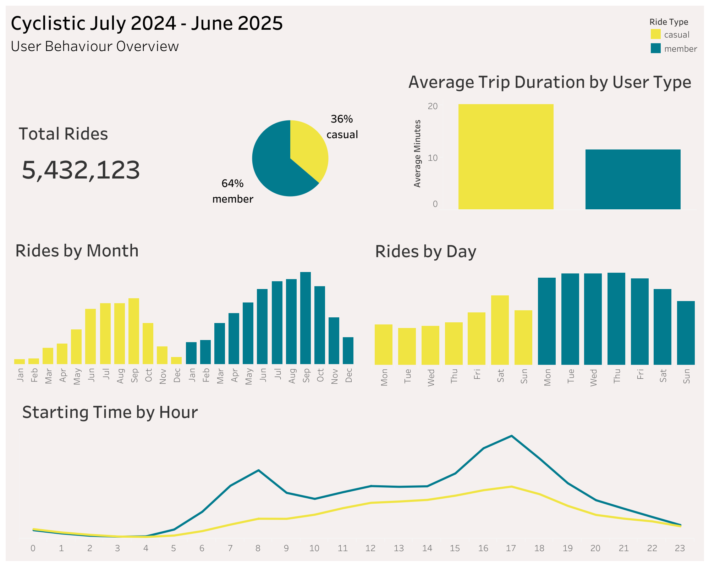
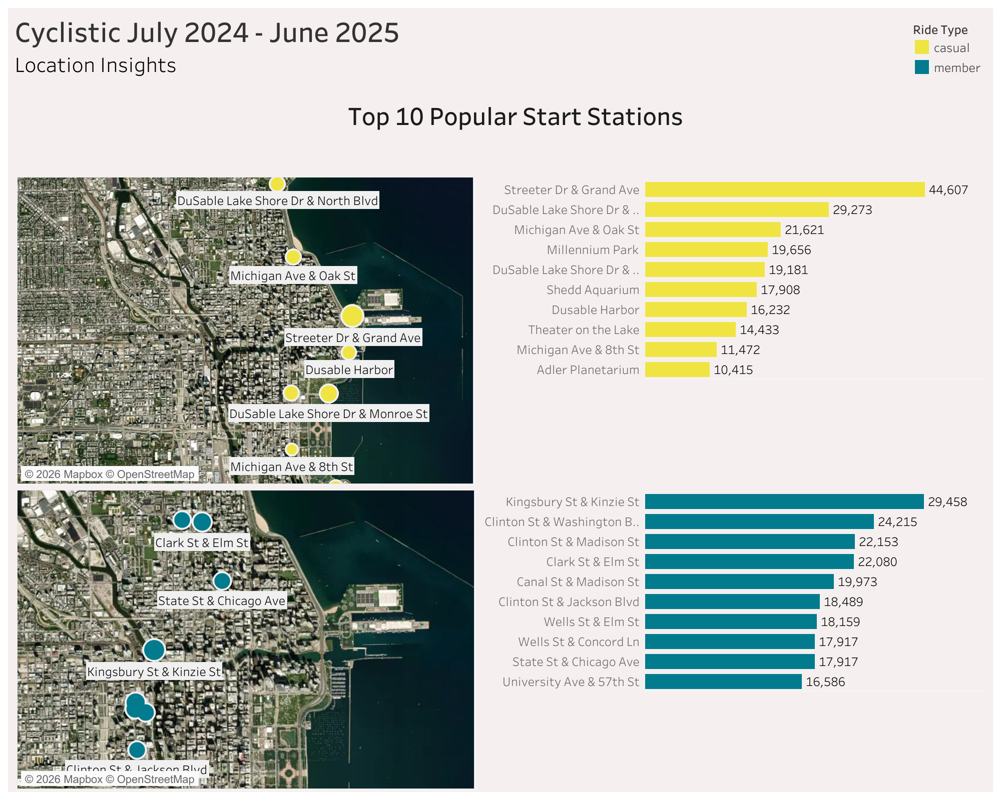

# Cyclistic Bike Share Analysis
A consumer behviour data analysis exploring behavioral differences between casual riders and members for Cyclistic, a fictional bike share company operating in Chicago.

The project was completed as part of the Google Data Analytics Certificate and served as the capstone of the course.

## Project Structure

[Project Overview](#project-overview)

[Data Source](#data-source)

[Tools Used](#tools-used)

[Data Cleaning & Transformation](#data-cleaning--transformation)

[Dashboards](#dashboards)

[Analysis](#analysis)

[Conclusion & Reasoning](#conclusion--reasoning)

[Key Insights](#key-insights)

[Recommendations](#recommendations)

## Project Overview

**Business Task:**  
The director of marketing at Cyclistic believes the company’s future growth depends on maximising the number of annual memberships. Therefore, i have been given the task to analyse how casual riders and annual members use Cyclistic bikes differently, uncover actionable insights, and provide recommendations to convert casual riders into annual members.

**User Conditions:**  
In Cyclistics’s bike share system, annual members require to pay an up front fee of 143 dollars per year and can enjoy unlimited 45 minute rides with no unlocking fees. Additional cost per minute is only added when exceeding the 45 minute limit.

In contrast, casual riders pay per ride, with unlocking fees of 1 dollar and additonal per-minute usage rates of 0.22 dollars.

**Main Question:**  
How do casual vs member users behave differently, and how can Cyclistic convert casual users into members?

## Data Source

The analysis used a 12 month Divvy bike share dataset ranging from July 2024 to June 2025.

Due to file size restrictions, the full dataset is not included but can be accessed via the original Divvy data sources found here: [Divvy Data](https://divvy-tripdata.s3.amazonaws.com/index.html)

## Tools Used

- **Excel**
- **SQL (BigQuery)**
- **Tableau**

## Data Cleaning & Transformation

The process started by downloading a dataset for each month between July 2024 and June 2025 from Divvy database.
Later, the csv files were uploaded to BigQuery using buckets on Google Cloud Storage.

However, before including SQL in the process, an initial examination of the data was performed using Excel. Due to the size of the datasets combined, each file required individual exploration.
Using filters, aggregation formulas, and pivot tables, an enhanced understanding of the data was provided. Worth noting was some null values and rides ending before they started. These inconsistencies were later explored further in BigQuery.

Using SQL, an initital pre-cleaning phase was performed to conduct a more profound understanding of the data, potential errors, and its overall capabilities to provide meaningful insights. Overall, this step served as the foundation for data validation and the identification of cleaning requirements.
The full process and justifications can be found here: [Pre-Cleaning SQL Queries](./cyclistic-bike-share-analysis/SQL/pre_cleaning_SQL.sql)

To conclude the cleaning and transformation process, over 130.000 rows containing errors removed in order to provide a fair analysis.
Additionally, new columns were created to facilitate the understanding of behavioural usage patterns.
The full process and justifications can be found here: [Cleaning Queries](./cyclistic-bike-share-analysis/SQL/cleaning_phase_SQL.sql)

## Dashboards

### User Behaviour Overview

### Location Insights

**Link to interactive dashboard:** [Tableau Public Dashboard](https://public.tableau.com/views/CyclisticAnalysis_17737226068460/UserBehaviourOverview?:language=en-GB&:sid=&:display_count=n&:origin=viz_share_link)

## Analysis

The outcome highlights several differences between casual riders and annual members in terms of ride behavior, usage frequency, trip duration, and geographic movement patterns. 

By examining trends across time, location, and ride activity, the analysis below aims to provide a deeper insight into how the two customer groups appear to use Cyclistic’s bike sharing services for different purposes.

**Ride Frequency**

In terms of rides by month, both casual riders and annual members followed a similar overall seasonal pattern, with ride frequency gradually increasing from January onward, peaking in September, and then declining during the later months of the year.

However, despite the similar overall trends, casual riders showcased a noticeably sharper increase in activity during the summer period. Between the months of March and June, casual rides increased by approximately 200%, a much stronger spike compared to annual members, indicating that casual users are more influenced by seasonal factors such as warmer weather, holidays, and outdoor leisure activities compared to annual members.

When analysing weekly ride activity, annual members demonstrated more consistent usage throughout weekdays, indicating that bike-sharing is integrated into their daily commuting and weekday routines. In contrast, casual riders showed significantly higher activity levels during weekends, suggesting a stronger connection to leisure and recreational usage.

Overall, the findings highlight clear seasonal and recreational usage patterns among casual riders. The strong increase in rides between spring and summer months, combined with higher weekend activity, suggests that many casual riders may be tourists or occasional users utilising the service primarily for leisure purposes.

**Ride Duration**

A major difference in usage patterns between the two groups is reflected in the average trip duration, where casual riders recorded almost double the average ride length compared to annual members.

This pattern further supports earlier observations, suggesting that casual riders are more likely to use the service for leisure-related activities rather than routine transportation. The longer ride durations may indicate usage for sightseeing, recreational trips, or more occasional exploratory travel around the city.

Annual members, on the other hand, evidentially take shorter rides, which aligns more closely with commuting behavior and regular transportation needs. This suggests that although members use the service more frequently, their rides are generally shorter and focused on efficient point-to-point transportation rather than leisure-oriented travel.

**Starting Time Trends**

Distinct differences also appeared when analyzing ride activity throughout the day. Annual members demonstrated clear peaks during traditional commuting hours, particularly around 8 AM and 5 PM, which further supports earlier observations that they use the service as part of transportation to and from workplaces and daily mobility needs. 

In contrast, casual rider activity followed a more gradual increase throughout the day, with ride frequency steadily rising from the late morning before reaching its highest point in the late afternoon around 5 PM. Unlike annual members, casual riders did not display a strong morning commute peak, suggesting that their usage is less associated with structured weekday routines and more connected to flexible activities.

The differing activity distributions throughout the day further highlight how the two customer groups appear to use the service for different purposes.

**Station & Geographic Patterns**

A geographic analysis revealed additional clear differences between the groups in terms of station usage. By mapping out popular ride locations, the findings suggests that annual members tend to start their trips near downtown business districts, transportation hubs, and workplace-centered areas. In contrast, casual riders were more commonly associated with stations located near parks, waterfronts, recreational zones, and tourist-heavy areas. 

The geographic distribution of rides further reinforces the behavioral differences observed throughout the analysis. While annual members display movement patterns centered around efficiency and urban mobility, casual riders demonstrate usage patterns more strongly connected to seasonal, recreational, and tourism-related activities.

## Conclusion & Reasoning

Overall, the analysis indicates that annual members and casual riders demonstrate significantly different usage behaviours. Annual members appear to use the service more consistently as part of regular urban transportation and commuting needs, while casual riders show stronger connections to seasonal, recreational, and leisure-oriented usage. 

Following the outcome, we get a better understanding of the behavioural differences between these two groups and more importantly, how to attract new annual members. The data related to casual riders provide highly valuable insight to the factors that should be considered when developing effective strategies to maximise membership conversion.

Differences in ride frequency, trip duration, time-of-day activity, and station usage suggest that converting casual riders into annual members may require targeted membership strategies tailored to their more recreational and seasonal usage behavior.

While the main objective is to drive annual memberships, it is important to consider that a large proportion of casual riders may consist of tourists, including one time visitors. Therefore, shorter membership deals such as weekly or over weekend passes could still drive revenue and serve as an effective entry point into the membership ecosystem if the company chooses to expand to other locations.

However, with the desired outcome being increased annual memberships rather than short-term memberships, greater focus should be placed on targeting recurring casual riders already located in, or frequently visiting the area.
The key in order to convert these riders is to communicate the financial and long-term benefits associated with becoming an annual member.

The first to consider are the financial benefits of becoming an annual member. As the anaylsis showed an average of 20 minutes trip duration for casual riders, we can, with a broad estimation, calculate an average cost of 5.4 dollars per casual ride.
This calculation is based on the variable of 0.22 dollars per minute plus the constant of 1 dollar for unlocking the unit.

With annual members paying an up front fee of 143 dollars, without unlocking fees, and additional costs per minute only if exceeding the 45 minute ride limit, a casual rider averaging 20 minutes per usage would breakeven just after 26 rides.

With this reasoning, casual riders whom to this apply, risk overpaying when using Divvys services without an annual membership.
Understanding the customers needs however is crucial in this stage as the benefits derived from this conclusion may not apply to tourists, but certainly to casual riders using the service regularly. 

In long-term, becoming an annual member can contribute to substantial cost savings for regular casual riders. Not only does the membership reduce overall ride costs, but it also provides greater flexibility and convenience for individuals who frequently rely on the service for spontaneous transportation or recreational purposes.

Furthermore, communicating the long-term environmental benefits associated with annual memberships may strengthen the perceived value of becoming a member. By encouraging more frequent bicycle usage as an alternative to cars or other forms of transportation, users may contribute to reduced traffic congestion, lower carbon emissions, and a more sustainable urban environment.
Positioning annual memberships not only as a financially beneficial option, but also as a lifestyle choice that supports healthier and more environmentally conscious mobility habits, may increase the attractiveness of membership adoption among recurring casual riders.

In order to most effectively target recurring riders, ideally we would require additional data, such as a unique identifier for each rider, not present in this dataset. Nonetheless,the analysis still provides valuable insight into where and when these are most likely to access Cyclistic’s services.

Therefore, marketing efforts should be optimized on the periods rides increase the most and locations where casual rider activity is the highest.
By launching a campaign running from March to September, increasing promotional activity on weekends, and targeting recreational and tourist-heavy areas, Divvy can maximize campaign exposure from beginning to end of peak seasonal demand.
This may increase the likelihood of reaching casual riders with the highest potential for future membership conversion.

Additionally, offering temporary membership trials or limited promotional discounts may encourage casual riders to experience the additional convenience and cost benefits associated with annual memberships. Allowing riders to directly experience these advantages may increase the likelihood of long-term conversion into annual members over time.

## Key Insights

1. **Casual riders are highly influenced by seasonality and leisure oriented usage**

Casual riders shows significantly higher increase in activity during summer months and weekends compared to annual members. This outcome suggests that many casual users primarily rely on the service for recreational and occasional travel rather than daily commuting.

2. **Casual riders tend to take longer and more flexible trips**

Compared to annual members, casual riders recorded substantially longer ride durations and a more gradual increase in activity throughout the day. This indicates a preference for flexible and experience oriented usage rather than short, routine transportation.

3. **Casual riders are strongly connected to recreational and tourist-heavy areas**

Station usage patterns revealed that casual riders are more commonly associated with parks, waterfronts, and tourist-heavy locations, unlike annual members who primarily travel between business and transportation-centered areas.

## Recommendations
  

1. **Promote the long-term value of annual memberships during peak casual rider seasons**

Launch targeted March to September, and weekend campaigns, the periods casual riders showcase highest increase in in use of the service.
Emphasize how frequent casual riders could reduce overall ride costs and gain additional benefits by switching to annual memberships. For example how a one tim payment provides accessibility to bikes without having to worry about unlocking fees.

2. **Offer limited-time incentives encouraging casual riders to transition into annual members**

Provide incentives such as discounted first-year memberships and free trial periods for casual riders with high ride frequency or long-duration trips to lower the barrier toward membership conversion. The casual riders may need more incentives than just overall lower costs. By providing a trial or a discount, particularly during peaking period, they might be more susceptible and therefore commit.

3. **Target casual riders directly at high-traffic recreational stations**

In order to most effectively reach the targeted segment, we should implement location-based marketing at parks, waterfronts, and tourist-heavy stations. These are areas most commonly recorded for ride initiation, and may serve as the most efficient way to reach our target audience.
Digital billboards and geo-fenced mobile app notifications could serve as efficient means to reach the targets. By leveraging the app, every time they open it to connect, a pop up could appear with an offer they can't refuse.

 ---

  **Additional Recommendation Focusing On Tourists**

As a supplement to only aim for an increased membership conversion, Cyclistic has a strong possibility of increasing revenue by targeting tourists. In order to do so, they can:

4. **Offer a Variety of Membership Types**

Introduce flexible membership options to appeal to the tourist rider segment, such as weekend-only passes and a 1-week tourist membership.
Although it does not fully agree with the main purpose of this analysis, it certainly could drive additional revenue and increase customer loyalty with the company and in that way support a stable long term growth.
